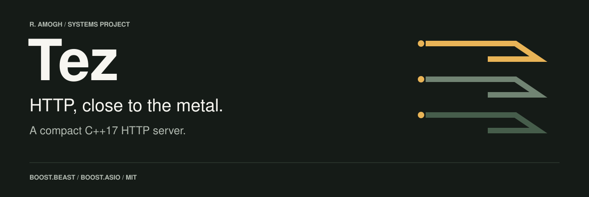
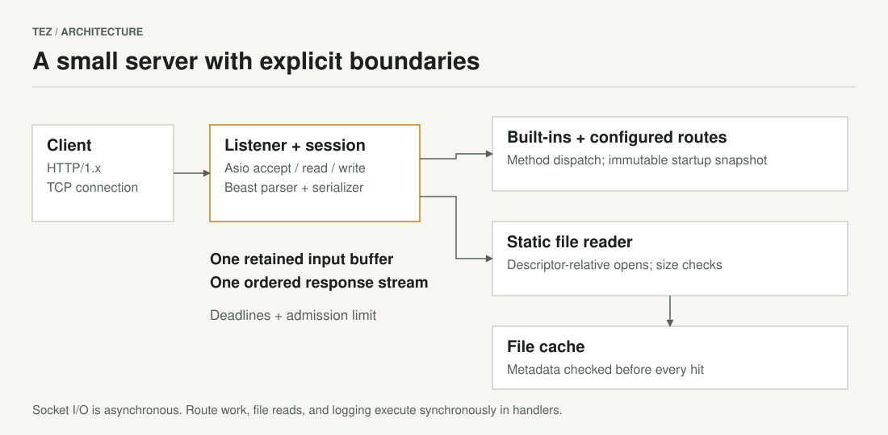

<p align="center">
  
</p>

<p align="center">
  <a href="https://github.com/Amogh-2404/Tez/actions/workflows/ci.yml"></a>
  <a href="https://en.cppreference.com/w/cpp/17"></a>
  <a href="LICENSE"></a>
</p>

<p align="center">
  <a href="#build-and-run">Get started</a> ·
  <a href="examples/fixtures/README.md">Examples</a> ·
  <a href="docs/configuration.md">Configuration</a> ·
  <a href="docs/architecture.md">Architecture</a> ·
  <a href="docs/deployment.md">Containers</a> ·
  <a href="docs/engineering.md">Engineering notes</a>
</p>

Tez is a compact C++17 HTTP server for serving local files, keeping fixed HTTP responses in Git, and following a request from socket to response. It combines Boost.Beast's HTTP parser with Boost.Asio's asynchronous networking, JSON routes, and static file serving.

The focus is explicit behavior: bounded requests, ordered responses, controlled file access, and tests that exercise the actual wire protocol. This checkout is **1.1.0-dev**. It is under active development; published images may contain older code. There is no current performance ranking or production-readiness claim.

## What is here

| Area | Behavior |
| --- | --- |
| Networking | Asynchronous accept, read, and write; multiple I/O workers; per-session strands |
| HTTP | HTTP/1.0 and HTTP/1.1, persistent connections, ordered pipelining, chunked request bodies, `HEAD`, `Expect: 100-continue` |
| Routing | Startup-loaded JSON responses; `/health`; `/echo` and `/api/data` demonstration endpoints |
| Static files | Explicit document root, descriptor-relative file opens, symlink rejection, bounded in-memory cache with metadata revalidation |
| Resource controls | Header/body limits, connection admission limit, operation deadlines, request cap per connection |
| Operations | Command-line settings, stderr request logs, non-root container, unit and socket integration tests |

TLS, HTTP/2, HTTP/3, WebSocket, compression, authentication, rate limiting, and persistent application storage are outside the current implementation. Static reads and log writes are synchronous inside I/O handlers. See the [protocol and resource limits](docs/configuration.md#limits) before deploying.

## Build and run

Requirements: a C++17 compiler, CMake 3.20+, Boost 1.74+, and nlohmann/json 3.7+. Linux and macOS are the supported build targets. Tests also require GoogleTest and Python 3.8+.

<details>
<summary>Install dependencies</summary>

macOS:

```sh
brew install cmake boost nlohmann-json googletest python
```

Ubuntu / Debian:

```sh
sudo apt-get update
sudo apt-get install build-essential cmake libboost-all-dev nlohmann-json3-dev libgtest-dev python3
```

</details>

From the repository root:

```sh
git clone https://github.com/Amogh-2404/Tez.git
cd Tez
cmake -S . -B build -DCMAKE_BUILD_TYPE=Release -DBUILD_TESTING=ON
cmake --build build --parallel 2
ctest --test-dir build --output-on-failure
```

For a server-only build, pass `-DBUILD_TESTING=OFF`. See [CONTRIBUTING.md](CONTRIBUTING.md) for sanitizers and development checks.

### Run, request, edit, repeat

Start with the [fixed-response example](examples/fixtures/README.md). Validate its paths and routes, then start the server:

```sh
./build/Tez --check-config \
  --config examples/fixtures/routes.json --static-dir examples/fixtures/static
./build/Tez \
  --config examples/fixtures/routes.json --static-dir examples/fixtures/static
```

`--check-config` validates configuration without opening a listener and exits nonzero if validation fails. The start command listens on `127.0.0.1:8080`. In another terminal:

```sh
curl --fail http://127.0.0.1:8080/hello
```

Expected body:

```text
hello, Tez
```

Open [examples/fixtures/routes.json](examples/fixtures/routes.json) and change the `/hello` route's `body` to `"hello from my project\n"`. Stop Tez with `Ctrl-C`, rerun the validation and start commands, then request `/hello` again:

```text
hello from my project
```

Routes are loaded at startup, so editing the file requires a restart. Each configured route returns a fixed response to `GET` or `HEAD`; it does not store application state.

Open [http://127.0.0.1:8080/static/index.html](http://127.0.0.1:8080/static/index.html) for a small browser demo served by the same process. It sends real same-origin requests to the JSON, text, and error fixtures. The [example guide](examples/fixtures/README.md) also covers static files, `HEAD`, failure responses, and `/echo`.

The built-in `/health` returns `{"status":"ok"}`. To run the repository's welcome page instead, stop the example and run `./build/Tez --config config.json --static-dir static`.

## Run in Docker

Build the current checkout to get the behavior documented here:

```sh
docker build -t tez:local .
docker run --rm --name tez \
  --read-only --cap-drop=ALL --security-opt=no-new-privileges \
  -p 127.0.0.1:8080:8080 tez:local
```

For the mutable `ramogh2404/tez:main` development image, see the [registry instructions](docs/deployment.md#development-registry-image). Verify its revision and pin a digest for deployments.

The image runs as UID/GID `10001`, listens on port `8080` inside the container, and writes request logs to stderr. See [deployment](docs/deployment.md) for bind mounts, Compose, image tags, and resource sizing. The [Docker Hub overview](docs/dockerhub.md) is maintained alongside the code.

## Configure it

Runtime settings are command-line flags:

```sh
./build/Tez --address 127.0.0.1 --port 9000 --threads 2 \
  --timeout 15 --max-connections 64 --body-limit 1048576 \
  --config config.json --static-dir static
```

Define fixed responses in `config.json`:

```json
{
  "/hello": {
    "status": "200 OK",
    "content_type": "text/plain; charset=utf-8",
    "body": "hello, Tez\n"
  }
}
```

Configuration is read at startup. Restart after editing routes. Static files live under `/static/`; for example, `static/style.css` is served at `/static/style.css`. The [configuration reference](docs/configuration.md) covers path resolution, validation, methods, limits, and compatibility.

## How it works



A connection owns its parser, retained input buffer, deadline, and response lifetime. I/O workers share an `io_context`; a strand serializes each session. Configured routes are immutable after startup. File access checks run before cache hits, so a cached response does not bypass path validation.

Read the [architecture](docs/architecture.md) for ownership and shutdown behavior, and the [engineering notes](docs/engineering.md) for standards, tradeoffs, and follow-up work.

## Performance evidence

No benchmark of the current implementation is available. The four [historical captures](metrics/) from October 2025 contain only 100 requests each and runs lasting roughly 9–11 ms. They cover different response sizes and lack enough environment metadata for comparison. They do not establish current throughput, latency, or a speedup over other servers.

The [measurement plan](docs/performance.md) records those results without extrapolation and defines how to evaluate future changes on a suitable machine. Correctness checks and architectural reasoning are kept separate from measured performance.

## Contribute

Start with [CONTRIBUTING.md](CONTRIBUTING.md). Reproducible bugs, protocol edge cases, documentation corrections, and focused patches are welcome. Report vulnerabilities privately using [SECURITY.md](SECURITY.md).

Built with [Boost.Beast](https://www.boost.org/doc/libs/latest/libs/beast/doc/html/index.html), [Boost.Asio](https://www.boost.org/doc/libs/latest/doc/html/boost_asio.html), [nlohmann/json](https://github.com/nlohmann/json), and [GoogleTest](https://github.com/google/googletest).

Maintained by **R. Amogh**. [MIT licensed](LICENSE).
